<p align="center">
  
</p>

<p align="center">
  <a href="https://github.com/owengregson/mac-duo-rebirth/releases/download/dev/Duo-Fold-dev.dmg"><picture><source media="(prefers-color-scheme: dark)" srcset="assets/buttons/dmg-dark.svg">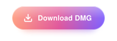</picture></a>
  <a href="https://github.com/owengregson/mac-duo-rebirth/releases"><picture><source media="(prefers-color-scheme: dark)" srcset="assets/buttons/releases-dark.svg"></picture></a>
</p>

<p align="center">
  Duo Fold brings the iPhone Duo effect to your MacBook. Close the lid and the screen leans back,
  blurs and dims toward the far edge while it stays sharp at the hinge. Free and open source,
  it runs from the menu bar and needs no permissions. Works on MacBooks with a lid angle sensor;
  Duo Fold tells you if yours has none.
</p>

> [!TIP]
> You don't have to close the lid to see it. Open Duo Fold from the menu bar and press **Preview**: the effect plays once, and <kbd>Esc</kbd> ends it at any time.

<br>

<p align="center"><picture><source media="(prefers-color-scheme: dark)" srcset="assets/headers/presets-dark.svg">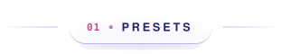</picture></p>

Each preset sets nine values: where the effect starts, how long it takes to build, how blurred and dark it gets, and how the picture leans. The sliders fine-tune from there.

<p align="center">
  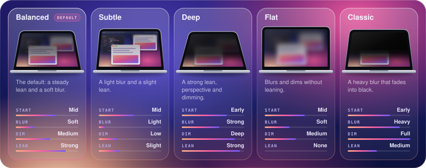
</p>

<p align="center"><sub>Blur in the thumbnails is exaggerated so it reads at this size.</sub></p>

<br>

<p align="center"><picture><source media="(prefers-color-scheme: dark)" srcset="assets/headers/fold-dark.svg">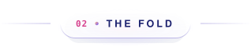</picture></p>

The effect depends on two things: how far the lid has closed, and how high up the screen a pixel sits. Near the hinge the picture stays sharp. Toward the far edge it blurs and darkens.

<p align="center">
  
</p>

Past the start angle, blur, dimming and lean each ramp up on their own curve. Blur starts slowly, so a small nudge leaves the screen readable. Dimming arrives early. The lean eases into its limit instead of stopping dead.

<p align="center">
  
</p>

<p align="center"><sub>Plotted from <code>LidEffectRamp</code> and <code>BlurGradient</code>, the same math the renderer runs. The ticks along the bottom are where the trackpad taps.</sub></p>

<br>

<p align="center"><picture><source media="(prefers-color-scheme: dark)" srcset="assets/headers/haptics-dark.svg">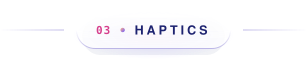</picture></p>

The trackpad taps as the lid closes. Taps follow the same progress that drives the blur, from where the effect starts to full strength, and, if you choose, on the way back up.

<p align="center">
  
</p>

<p align="center"><sub>Each bar is one tap, as tall as it is strong. A lid resting on a tap has to back off a little before that tap plays again, so a sensor reading that flickers never buzzes.</sub></p>

<br>

<p align="center"><picture><source media="(prefers-color-scheme: dark)" srcset="assets/headers/technical-dark.svg">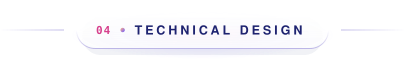</picture></p>

Duo Fold is built to be invisible until the lid moves: nothing polls, nothing is captured, nothing asks for permission. Then the picture moves at every screen refresh, from a sensor that reports ten times a second.

<p align="center">
  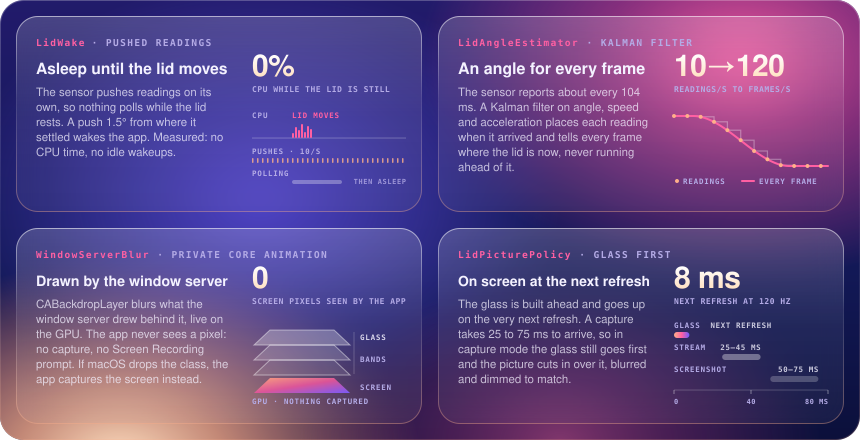
</p>

- **Asleep until the lid moves.** The sensor pushes its own readings, so the app polls nothing while the lid rests. Measured: no CPU time and no idle wakeups.
- **An angle for every frame.** A Kalman filter turns readings 104 ms apart into a position for every refresh, and never runs ahead of the lid.
- **Drawn by the window server.** `CABackdropLayer` blurs the screen live on the GPU. The app never sees a pixel and never asks for Screen Recording.
- **On screen at the next refresh.** The glass is built ahead. If macOS can't draw it, a ScreenCaptureKit and Metal fallback takes over, matched to the glass.

<br>

<p align="center"><picture><source media="(prefers-color-scheme: dark)" srcset="assets/headers/settings-dark.svg">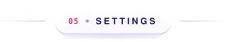</picture></p>

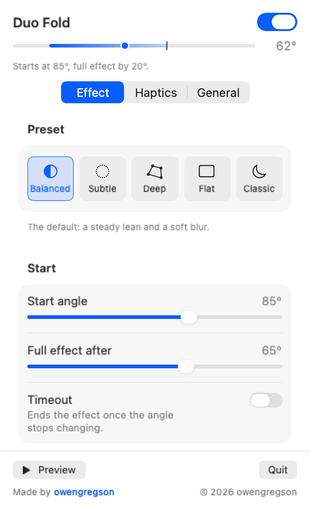

Everything lives in one panel under the menu bar icon. The gauge at the top shows the live lid angle against where the effect starts and where it peaks.

**Effect.** Preset, start angle, how much further the lid closes to reach full effect, an optional timeout, blur and dimming with their spread, lean back, max lean, perspective, and live rendering.

**Haptics.** Pattern, strength, number of taps, and whether to tap while opening. **Try** plays the pattern now.

**General.** Language, launch at login, the menu bar icon and angle, and a full reset.

**Preview** plays the effect once without closing the lid. Press <kbd>Esc</kbd> to end it.

<br clear="right">

<br>

<p align="center"><picture><source media="(prefers-color-scheme: dark)" srcset="assets/headers/developers-dark.svg">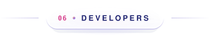</picture></p>

Duo Fold is a Swift package with no third-party dependencies. It builds with Xcode and Swift 6.0 or later; `mise install` fetches a toolchain if you use [mise](https://mise.jdx.dev).

```sh
./build.sh              # build and sign build/Duo Fold.app
./build.sh --run        # build, sign and relaunch
./build.sh --universal  # one binary for Apple Silicon and Intel
swift test              # unit tests
```

The app is signed ad hoc unless `SIGN_IDENTITY` names your own identity. The build also leaves `build/lidprobe` next to the app, for checking the sensor:

```sh
build/lidprobe          # stream the angle
build/lidprobe rate     # how often the hardware value changes
build/lidprobe reset    # put the sensor back to pushing once a second
```

> [!NOTE]
> The sensor's push rate is system-wide and outlives the app. Duo Fold restores it when it quits or the Mac sleeps, but can't after a force quit; `build/lidprobe reset` puts it back.

<p align="center">
  
</p>

```
Sources/
  LidAngleKit/          LidAngleSensor: the HID lid angle sensor, shared with lidprobe
  DuoFold/
    LidController         polls, sleeps and wakes; drives everything below
    LidAngleEstimator     Kalman filter: an angle for every frame
    LidWake               push watch, wake filter, clamshell watch
    LidEffectPolicy       motion intent and LidEffectRamp
    BlurGradient          how blurred and dark each height is
    WindowServerBlur      private Core Animation, looked up and checked at runtime
    FrostedGlassView      the glass: FrostBandLayout, GlassLean, ScreenCorner
    ScreenStreamer        capture fallback: BlurStack, DepthRenderer, DepthShaders
    HapticPattern         tap patterns, played by TrackpadHaptics
    EffectPreset          the five presets; Preferences stores the rest
    SettingsView          the menu bar panel, opened by StatusItemController
  lidprobe/             command-line probe for the sensor
Tests/DuoFoldTests/     unit tests, plus glass fidelity reports behind FIDELITY_DIR
scripts/                make-app-icon.swift draws the app icon
```

**Contributing**

- Open an [issue](https://github.com/owengregson/mac-duo-rebirth/issues) before anything bigger than a fix, so the design can be talked through first.
- Private Core Animation stays inside `WindowServerBlur.swift`, looked up by name and checked before use. A missing class means the capture fallback, never a crash.
- Every user-facing string goes in both `en.lproj` and `zh-Hans.lproj`; `LocalizableStringsTests` keeps them in step.
- Tuning values come from measurements. When you change one, leave the measurement in the comment beside it, as the code does now.
- Run `swift test` before a pull request. The fidelity tests are slow and only run with `FIDELITY_DIR=<folder>` set; they write the frames side by side for comparison.
- Read the app's logs with `log show --last 5m --predicate 'subsystem == "com.owengregson.duofold"'`.

<br>

<p align="center"><picture><source media="(prefers-color-scheme: dark)" srcset="assets/divider-dark.svg"></picture></p>

<p align="center"><sub>Derived from <a href="https://github.com/sumimakito/Mac-Duo">Mac Duo</a> by Makito. Built with AI assistance. Icons from <a href="https://lucide.dev">Lucide</a>.</sub></p>

<p align="center"><sub>Licensed under the <a href="LICENSE">Apache License 2.0</a>. Copyright 2026 owengregson. See <a href="NOTICE">NOTICE</a> for attribution.</sub></p>

<p align="center"><sub><b>DUO FOLD</b> by <a href="https://github.com/owengregson">@owengregson</a></sub></p>
